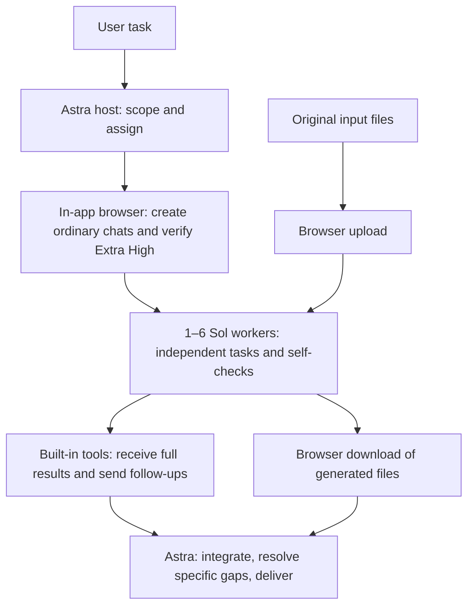

# ChatGPT Web Workers

**Let Astra lead. Let Sol do substantial work.**

[简体中文](README.zh-CN.md) · [Skill instructions](skills/chatgpt-web-workers/SKILL.md) · [Releases](https://github.com/YUTA-fywoo/chatgpt-web-workers/releases) · [MIT license](LICENSE)

A Codex desktop skill designed around an **Astra host coordinating 1–6 ordinary ChatGPT chats at Sol Extra High (`xhigh` / 极高)**. Workers research, analyze, draft, calculate, or propose code; the host integrates complete results and delivers the final outcome.

**No additional MCP server or API key setup.** It uses the desktop app's existing in-app browser and built-in conversation tools. Those capabilities and a signed-in ChatGPT account are required; this repository does not supply them.

## Why use it?

| Feature | Practical benefit |
|---|---|
| Astra-led allocation | Keep framing, difficult judgments, dependencies, and synthesis with the host; give Sol meaningful, bounded deliverables. |
| 1–6 web workers | Dispatch ready independent tasks before waiting, so workers can generate concurrently. Start with one and expand only when useful. |
| Direct text communication | After browser initialization, read replies and send follow-ups by conversation ID instead of repeatedly navigating pages. |
| One owner per work unit | Prevent the host from repeating research or calculations already assigned to a worker. Return corrections to the original owner first. |
| Full reports, received once | Preserve the detailed evidence Astra needs for synthesis, while suppressing unchanged replies and duplicate context. |
| Checks tied to actual issues | Workers self-check. The host accepts and integrates, adding focused checks for conflicts, missing evidence, failed artifacts, or required verification. |
| Predictable file handling | Original uploads and newly generated downloads go straight through the browser; do not spend attempts on unsupported attachment arguments. |
| Reusable task chats | Continue coherent subtasks in the same conversation, retain task markers and revisions, and recover from stale reads without duplicate sends. |

The aim is to use host allowance more effectively by moving useful work to Chat and reducing repeated work and orchestration. **No percentage of quota savings or speedup has been measured.** Host input/output and worker messages still consume allowance; a tiny task may cost more to delegate than to do directly.

## How it works



Browser setup and submission are sequential; the submitted workers can run concurrently. Dependent tasks remain ordered. Browser use also covers the first prompt, settings, file transfer, and concrete recovery needs—not just conversation activation.

The direct path uses `read_thread` and `send_message_to_thread`. It verifies the persisted chat ID and task/revision in the new answer. A send acknowledgement, an old completed answer, or an idle status is not proof that the latest task is complete. Tool availability and schemas must match the current client.

## Requirements

- Codex in the desktop app with the in-app browser and built-in conversation read/send tools available to the host.
- A signed-in ordinary ChatGPT **Chat** that exposes **Extra High / 极高** for the default workflow.
- Astra is the intended host, selected by you where available. Installing the skill does not change or unlock a model.
- Permission to send the task's necessary material to the selected ChatGPT conversations. Workers do not automatically share host files or tools.

Validated in Windows Codex desktop with the Chinese ordinary Chat UI. Other operating systems, account tiers, and future UI versions are not covered by that validation. A generic CLI-only or third-party agent setup is insufficient if it lacks these desktop capabilities.

## Install

### Ask Codex to install the standalone skill

```text
$skill-installer Install the skill at skills/chatgpt-web-workers from
https://github.com/YUTA-fywoo/chatgpt-web-workers
```

The installable skill is the **subfolder** `skills/chatgpt-web-workers`, not the repository root. Codex's installer supports skills from other repositories. If the installed skill does not appear, restart the app. See the [official skill documentation](https://learn.chatgpt.com/docs/build-skills).

### Manual installation

Download `chatgpt-web-workers-v1.0.0-skill.zip` from [Releases](https://github.com/YUTA-fywoo/chatgpt-web-workers/releases), then place the extracted `chatgpt-web-workers` folder in your client's skill directory. Current documented locations include:

- Personal: `~/.agents/skills/chatgpt-web-workers/`
- Project: `<project>/.agents/skills/chatgpt-web-workers/`

The tested desktop environment uses `$CODEX_HOME/skills/chatgpt-web-workers` (normally `~/.codex/skills/chatgpt-web-workers`). Use the location your client discovers; avoid installing duplicate copies under the same skill name. The final folder must contain `SKILL.md`, `agents/`, and `references/`.

### Plugin packaging

The repository also contains `.codex-plugin/plugin.json` and the `skills/` directory for plugin distribution. The release's `-plugin.zip` preserves that layout. This is a GitHub source release; it is **not a claim of acceptance into OpenAI's plugin directory**. The standalone skill is the documented quick-start path here.

## Use

```text
Use $chatgpt-web-workers to research [topic]. Split independent work across
up to three web workers, keep each scope separate, and give me one integrated
report with sources, uncertainties, and a recommendation.
```

```text
Use $chatgpt-web-workers to analyze these two files. Upload each original only
to the worker that needs it. Integrate the results and deliver a checked final file.
```

Invoking the skill requires **at least one and at most six distinct worker chats per task**, including replacements. It does not recursively spawn workers. Small tasks still use one worker under this policy; leave the skill out when delegation adds no value.

## Plus users: adapting to Sol High

If your Plus account offers **Sol High / 高** but not Extra High, ask Codex/GPT to adapt your local copy explicitly:

```text
Adapt my installed chatgpt-web-workers skill to the Sol High option actually
available in my ordinary ChatGPT account. Change the default effort and all
browser checks/examples that depend on Extra High consistently. Keep the
1–6 worker limit, direct text route, browser file routes, scope ownership,
full-result receipt, and acceptance rules. Do not silently switch to Work or
Pro reasoning. Report an unavailable setting instead of claiming it was verified.
```

This is an **opt-in adaptation**, not a bundled or tested High preset. The published default remains Extra High. Model/effort availability depends on the account and rollout; the skill does not grant Astra access to a Plus account. OpenAI documents a Sol thinking slider for Plus and Pro in ordinary Chat, but that does not establish every account's exact available setting. See [official ChatGPT updates](https://learn.chatgpt.com/docs/whats-new).

## Why this Astra/Sol split?

The allocation is a project design choice informed by the official [Astra guide](https://developers.openai.com/api/docs/guides/latest-model) and [Sol guide](https://developers.openai.com/api/docs/guides/latest-model?model=gpt-5.6): let Astra maintain the overall task and resolve cross-part decisions; give Sol clear goals, essential context, constraints, and success criteria. Prompts avoid repeating instructions or forcing needless intermediate narration. This is not an official benchmark or endorsement of this workflow.

See [model-guidance.md](skills/chatgpt-web-workers/references/model-guidance.md) for the rationale, [transport.md](skills/chatgpt-web-workers/references/transport.md) for communication, and [files.md](skills/chatgpt-web-workers/references/files.md) for file handling.

## Validation and limits

Tests recorded on **2026-09-11** established direct reads from newly created chats, direct follow-ups, stale-read recovery, text/PNG uploads and content checks, reuse of prior attachments, and actual generated TXT downloads. Newly generated TXT/ZIP outputs were **not** received as file bytes through direct conversation reads. A generated ZIP appeared in the browser, but its browser download was not completed during that test. Do not infer universal file-format support.

Later ownership, full-result caching, and polling rules were checked as instruction changes; there is no benchmark for their exact savings. This release adds bilingual documentation and packaging without changing the six installed skill files. See the [detailed validation record](skills/chatgpt-web-workers/references/validation.md).

No external service, credential collector, or MCP server ships with this repository. Prompts and authorized attachments are sent to your ChatGPT account through the app. The workflow does not bypass limits, access controls, or required approvals. Keep private conversation URLs, files, and account details out of public issue reports.

## Repository layout

```text
.codex-plugin/plugin.json         # Plugin metadata
skills/chatgpt-web-workers/
  SKILL.md                       # Agent instructions
  agents/openai.yaml             # Skill UI metadata
  references/transport.md        # Creation, messaging, concurrency and recovery
  references/files.md            # Uploads and generated-file downloads
  references/model-guidance.md   # Allocation and prompting rationale
  references/validation.md       # Observed capabilities and limitations
README.md                        # English guide
README.zh-CN.md                   # Chinese guide
CHANGELOG.md
LICENSE
```

Bug reports and improvements are welcome through [GitHub Issues](https://github.com/YUTA-fywoo/chatgpt-web-workers/issues). Include the client/OS, visible mode and effort, expected behavior, and a sanitized reproduction. Distinguish a tested behavior from a proposed optimization.

Released under the [MIT License](LICENSE). Independent community project; not affiliated with or endorsed by OpenAI.
