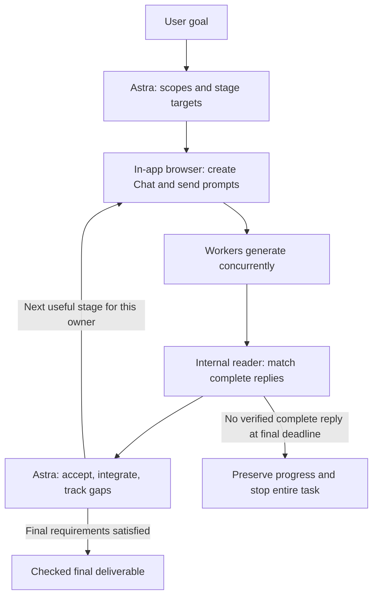

# ChatGPT Web Workers

**Let Astra coordinate the goal. Let each Chat finish one useful stage.**

[简体中文](README.zh-CN.md) · [Download v1.1.0](https://github.com/YUTA-fywoo/chatgpt-web-workers/releases/tag/v1.1.0) · [Changelog](CHANGELOG.md) · [MIT license](LICENSE)

A Codex desktop skill that delegates work to **1–6 ordinary ChatGPT chats at Extra High / 极高**, proactively using **4–6 for substantial independent work**. Astra owns the overall goal, stage acceptance, cross-part decisions, and final delivery. Workers are called **Sol** as a project prompting convention.

Uses the desktop app's existing in-app browser and internal conversation reader. No extra MCP server or API key setup is required by this skill; availability depends on the tools and settings actually exposed in your client and account.

## What's new in v1.1.0

| Improvement | Behavior |
|---|---|
| Active distribution | Plan independent scopes before dispatch; prefer 4–6 for substantial work. Total distinct chats, including replacements, remains 1–6. |
| One primary result per prompt | End each stage at an assessable result. Do not combine discovery, exhaustive verification, ranking, and final reporting in one huge prompt. Closely coupled operations and self-checks may stay together. |
| Independent continuation | Accept each completed reply at a scheduled check and advance that owner while other chats continue. No full-wave barrier; at most one unanswered assignment per chat. |
| Preserve collection volume | Splitting stages does not shrink assigned targets into a small pilot or introduce arbitrary search caps. Later stages adapt to real gaps and the final goal. |
| Internal reads, webpage sends | Use internal tools for replies. Initial prompts, follow-ups, corrections, retries, and Chat controls all use the in-app browser. Internal sending is no longer an allowed fallback. |
| Explicit timing | Reply scans start at minute 10, then every 5 minutes. Webpage checks start at minute 15, then every 10. Each revision has a 90-minute deadline. |
| Ownership and actual access | New external evidence collection belongs to the assigned Chat. Host-only accounts, plugins, APIs, or local paths do not establish Chat access. |
| Durable task state | Persist the objective, revisions, dependencies, accepted evidence, gaps, and next actions. Receipt, acceptance, and final task completion are distinct. |
| Complete results, less repetition | Cache raw replies, use compact probes, deliver each new complete reply once, then read relevant cached sections or actual changes. Full first receipt remains required. |
| Focused instruction loading | Transport for worker operation; file guidance for transfer; model rationale for maintenance. Domain-specific standards belong to dependent skills. |


## How it works



Browser creation and sends are sequential; worker generation is concurrent. Timers are anchored to each revision's actual submission. The host can classify, deduplicate, calculate, resolve conflicts, assemble artifacts, and run required local checks using supplied evidence. New external collection or source-page checks return to Chat unless explicitly authorized for the host by the user. Slow replies and blocked sources do not authorize silent takeover.

## Waiting and recovery

- Reply checks: minutes **10, 15, 20, …, 85**, with a final check at **90**.
- Webpage checks: minutes **15, 25, 35, …, 85**. When both checks are due, read first and skip the webpage check if the complete reply was received.
- Follow visible error instructions. Refresh once only when there is no result and no active thinking, processing, or generation. Slow generation alone is not a refresh reason.
- Refreshes, retries, partial replies, and context recovery never reset the deadline. A new follow-up after a completed reply gets its own clock.
- At 90 minutes, check completion; use the known webpage if the internal result is ambiguous. If any pending revision still lacks a verified complete reply, **preserve progress and stop the entire task**. Resume only on explicit user instruction; no automatic continuation or host takeover.

The 90-minute rule supersedes the earlier one-hour setting discussed during development. It is per revision, not a total limit for a multi-stage task. A completed reply reporting a limitation is a returned result. The full procedure is in [transport.md](skills/chatgpt-web-workers/references/transport.md).

## Install or update

```text
$skill-installer Install skills/chatgpt-web-workers from
https://github.com/YUTA-fywoo/chatgpt-web-workers
```

Alternatively, download `chatgpt-web-workers-v1.1.0.zip` from [Releases](https://github.com/YUTA-fywoo/chatgpt-web-workers/releases/tag/v1.1.0), extract it, and install the contained `chatgpt-web-workers` folder. **Source code (zip)** instead contains the repository layout; its installable folder is `skills/chatgpt-web-workers`.

The tested Windows desktop installation uses `$CODEX_HOME/skills/chatgpt-web-workers`, normally `~/.codex/skills/chatgpt-web-workers`. Use the location your client discovers. Preserve local customizations when upgrading and avoid duplicate copies with the same skill name. The repository also provides `.codex-plugin/plugin.json` for plugin distribution.

**Migration from v1.0.0:** update all six skill files together. Remove local overrides that still permit internal sends, assume a one-hour timeout, cap substantial work at three chats, or wait for all chats before continuing an owner. Keep browser file routes.

## Use

```text
Use $chatgpt-web-workers to research [topic]. Use 4–6 chats if there are
enough independent scopes. Give each chat one assessable stage per prompt,
preserve the full collection targets, and advance completed owners independently.
Deliver one integrated report with evidence and limitations.
```

```text
Use $chatgpt-web-workers to analyze these files. Give each owner only its
required inputs, preserve the final goal across stages, and deliver a checked artifact.
```

```text
Use $chatgpt-web-workers for code proposals and focused critique of these
components. Keep scopes separate; review, execute necessary local checks,
and integrate the accepted results.
```

Supports research, extraction, writing, analysis, calculations, code proposals, and critique. No fixed research pipeline or step count is required. Use 1–3 chats for small or tightly coupled work, or an actual resource constraint.

## Prompting and quality

Each packet has a task/revision marker, a brief overall-goal anchor, one stage objective, relevant inputs and constraints, and a return contract. Follow-ups carry relevant changes rather than whole transcripts or unchanged tables. Shorter prompts must remain sufficient for the stage.

The design applies [OpenAI's Astra skill guidance](https://developers.openai.com/blog/rethinking-skills-and-prompts-for-gpt-6-astra) to concise descriptions, conditional reference loading, and outcome boundaries. Worker prompts use direct goals and clear input boundaries following general [reasoning guidance](https://developers.openai.com/api/docs/guides/reasoning-best-practices). See [model-guidance.md](skills/chatgpt-web-workers/references/model-guidance.md) for Sol-specific sources. The 4–6 preference and exact timers are project policies, not official OpenAI concurrency recommendations.

Verify the visible ordinary Chat **Extra High / 极高** setting. A Pro subscription badge is not Pro reasoning; prompts cannot activate API-only settings. If your account offers another effort, request an explicit local adaptation rather than silently substituting it.

The current policy preserves **full first receipt**, rather than replacing all reports with summaries. Later probes omit unchanged content; global comparisons can still require the full merged result. Original uploads and newly generated downloads use the browser, with actual bytes and content checked: [files.md](skills/chatgpt-web-workers/references/files.md).

The aim is to reduce duplicate host work while preserving evidence. **No savings percentage or universal no-regression claim has been measured.** Historical [validation](skills/chatgpt-web-workers/references/validation.md) retains its original dates; this release is not a new live test of every capability.

Feedback and sanitized examples are welcome in [Issues](https://github.com/YUTA-fywoo/chatgpt-web-workers/issues). [MIT licensed](LICENSE).
