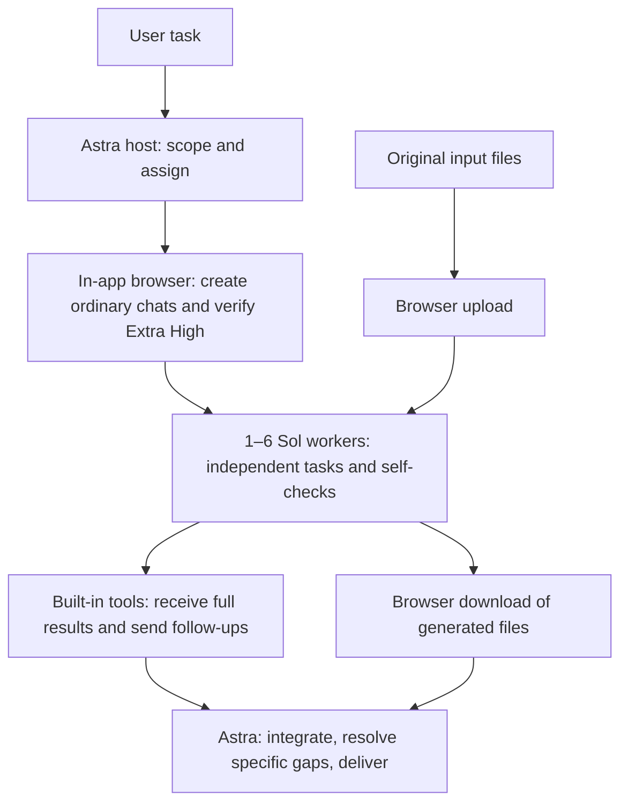

# ChatGPT Web Workers

**Let Astra lead. Let Sol do substantial work.**

[简体中文](README.zh-CN.md) · [Skill instructions](skills/chatgpt-web-workers/SKILL.md) · [Releases](https://github.com/YUTA-fywoo/chatgpt-web-workers/releases) · [MIT license](LICENSE)

A Codex desktop skill designed to **save Astra/Codex host allowance by delegating substantial work and cutting avoidable overhead**. An **Astra host coordinates 1–6 ordinary ChatGPT chats at Sol Extra High (`xhigh` / 极高)**. Workers research, analyze, draft, calculate, or propose code; the host integrates complete results and delivers the final outcome.

**No additional MCP server or API key setup.** Use the desktop app's existing in-app browser and built-in conversation tools with your signed-in ChatGPT account.

## Why use it?

| Feature | Practical benefit |
|---|---|
| Astra-led allocation | Keep framing, difficult judgments, dependencies, and synthesis with the host; give Sol meaningful, bounded deliverables. |
| 1–6 web workers | Dispatch ready independent tasks before waiting, so workers can generate concurrently. Start with one and expand only when useful. |
| Direct text communication | After browser initialization, read replies and send follow-ups by conversation ID instead of repeatedly navigating pages. |
| One owner per work unit | Prevent the host from repeating research or calculations already assigned to a worker. Return corrections to the original owner first. |
| Full reports, received once | Preserve the detailed evidence Astra needs for synthesis, while suppressing unchanged replies and duplicate context. |
| Checks tied to actual issues | Workers self-check. The host accepts and integrates, adding focused checks for conflicts, missing evidence, failed artifacts, or required verification. |
| Predictable file handling | Original uploads and newly generated downloads go straight through the browser; do not spend attempts on unsupported attachment arguments. |
| Reusable task chats | Continue coherent subtasks in the same conversation, retain task markers and revisions, and recover from stale reads without duplicate sends. |

The aim is to save Astra/Codex host allowance by moving substantial work to ordinary Chat and reducing repeated work, repeated context, and browser orchestration. Astra can focus its effort on the decisions and synthesis that benefit most from its capabilities.

## How the quota-saving strategy works

1. **Move useful work out of the host task.** Sol handles a bounded research pass, analysis, or complete draft in an ordinary Chat. Astra receives its result instead of performing that same work first and then asking a worker to repeat it.
2. **Reduce browser orchestration.** Use the browser to create and configure chats and submit the first task; then use the app's conversation tools for text reads and follow-ups. This avoids repeated page navigation and full-page reading for routine messages. Files and specific recovery needs still use the browser.
3. **Stop paying for duplicate context.** Receive a complete worker report once so Astra can use its detail. Later checks return compact state or changed material; old prompts, duplicate previews, and unchanged reports do not need to be fed back into host context every time.
4. **Avoid doing delegated work twice.** Each work unit has one owner. The host does not independently repeat pending or accepted worker searches, calculations, or drafts. Specific defects go back to the owner; required execution and verification still happen.
5. **Use parallelism where it helps.** Dispatch independent tasks together and use coherent follow-ups in the same chats. This can reduce waiting time; the skill chooses the worker count to suit the task.

For example, a report can give separate evidence-gathering scopes to three Sol chats. Astra keeps the question, constraints, outline, and cross-source judgment; it receives the three complete reports and writes the integrated answer. The saving opportunity is the host work and repeated input that this arrangement avoids.

The workflow combines task allocation and context discipline: delegate useful work, receive complete evidence, and keep follow-ups focused. See [OpenAI's usage guidance](https://learn.chatgpt.com/docs/pricing) for why relevant inputs, focused context, and appropriate outputs help make allowance last longer.

## How it works



Browser setup and submission are sequential; the submitted workers can run concurrently. Dependent tasks remain ordered. The browser handles the first prompt, settings, file transfer, and recovery when needed.

The direct path uses `read_thread` and `send_message_to_thread`. It verifies the persisted chat ID and task/revision in the new answer. Task markers and revisions keep results matched to the right request, while the workflow follows the current client's tool interfaces.

## Requirements

- Codex in the desktop app with the in-app browser and built-in conversation read/send tools available to the host.
- A signed-in ordinary ChatGPT **Chat** that exposes **Extra High / 极高** for the default workflow.
- Select Astra as the host where available to use the intended allocation.
- Provide each worker with the task material and files it needs through your authorized ChatGPT conversations.

Developed with Windows Codex desktop and the Chinese ordinary Chat UI.

## Install

### Ask Codex to install the standalone skill

```text
$skill-installer Install the skill at skills/chatgpt-web-workers from
https://github.com/YUTA-fywoo/chatgpt-web-workers
```

The installable skill is the **subfolder** `skills/chatgpt-web-workers`. Codex's installer supports skills from other repositories. If the installed skill does not appear, restart the app. See the [official skill documentation](https://learn.chatgpt.com/docs/build-skills).

### Manual installation

Download **Source code (zip)** from [Releases](https://github.com/YUTA-fywoo/chatgpt-web-workers/releases), extract it, and copy the inner `skills/chatgpt-web-workers` folder into your client's skill directory. Current documented locations include:

- Personal: `~/.agents/skills/chatgpt-web-workers/`
- Project: `<project>/.agents/skills/chatgpt-web-workers/`

The tested desktop environment uses `$CODEX_HOME/skills/chatgpt-web-workers` (normally `~/.codex/skills/chatgpt-web-workers`). Use the location your client discovers; avoid installing duplicate copies under the same skill name. The final folder must contain `SKILL.md`, `agents/`, and `references/`.

### Plugin packaging

The repository also contains `.codex-plugin/plugin.json` and the `skills/` directory for plugin distribution. The source archive preserves that layout. The standalone skill is the quick-start path; the repository root provides the matching plugin distribution structure.

## Use

```text
Use $chatgpt-web-workers to research [topic]. Split independent work across
up to three web workers, keep each scope separate, and give me one integrated
report with sources, uncertainties, and a recommendation.
```

```text
Use $chatgpt-web-workers to analyze these two files. Upload each original only
to the worker that needs it. Integrate the results and deliver a checked final file.
```

Invoking the skill requires **at least one and at most six distinct worker chats per task**, including replacements. Use one for a focused task and more for substantial independent work; coherent follow-ups reuse the same chats.

## Plus users: adapting to Sol High

If your Plus account offers **Sol High / 高** but not Extra High, ask Codex/GPT to adapt your local copy explicitly:

```text
Adapt my installed chatgpt-web-workers skill to the Sol High option actually
available in my ordinary ChatGPT account. Change the default effort and all
browser checks/examples that depend on Extra High consistently. Keep the
1–6 worker limit, direct text route, browser file routes, scope ownership,
full-result receipt, and acceptance rules. Do not silently switch to Work or
Pro reasoning. Report an unavailable setting instead of claiming it was verified.
```

The default is Extra High; Plus users can adapt their local copy to Sol High according to the options shown in their account. See [official ChatGPT updates](https://learn.chatgpt.com/docs/whats-new) for the ordinary Chat Sol thinking slider.

## Why this Astra/Sol split?

The allocation is a project design choice informed by the official [Astra guide](https://developers.openai.com/api/docs/guides/latest-model) and [Sol guide](https://developers.openai.com/api/docs/guides/latest-model?model=gpt-5.6): let Astra maintain the overall task and resolve cross-part decisions; give Sol clear goals, essential context, constraints, and success criteria. Prompts avoid repeating instructions or forcing needless intermediate narration. The practical goal is to use each model where it contributes most.

See [model-guidance.md](skills/chatgpt-web-workers/references/model-guidance.md) for the rationale, [transport.md](skills/chatgpt-web-workers/references/transport.md) for communication, and [files.md](skills/chatgpt-web-workers/references/files.md) for file handling.

## Built for complete delivery

The workflow combines task/revision matching, reusable attachments, complete report receipt, worker self-checks, and focused host acceptance. For files, it obtains the actual download and checks the required content and format. This keeps the handoff connected to a usable final deliverable.

The six skill files are preserved in this release, with bilingual guides and distribution packages added around them. The [technical record](skills/chatgpt-web-workers/references/validation.md) documents the transport behavior behind the implementation.

## Repository layout

```text
.codex-plugin/plugin.json         # Plugin metadata
skills/chatgpt-web-workers/
  SKILL.md                       # Agent instructions
  agents/openai.yaml             # Skill UI metadata
  references/transport.md        # Creation, messaging, concurrency and recovery
  references/files.md            # Uploads and generated-file downloads
  references/model-guidance.md   # Allocation and prompting rationale
  references/validation.md       # Observed capabilities and limitations
README.md                        # English guide
README.zh-CN.md                   # Chinese guide
CHANGELOG.md
LICENSE
```

## Suggestions welcome

Have an idea for better task allocation, smoother communication, or another useful workflow? Open a [GitHub Issue](https://github.com/YUTA-fywoo/chatgpt-web-workers/issues). Feedback, real-world use cases, and improvements are welcome. When reporting a problem, include the client/OS, visible mode and effort, expected behavior, and a sanitized example.

Released under the [MIT License](LICENSE). You can use, modify, and share the skill with the license notice.
