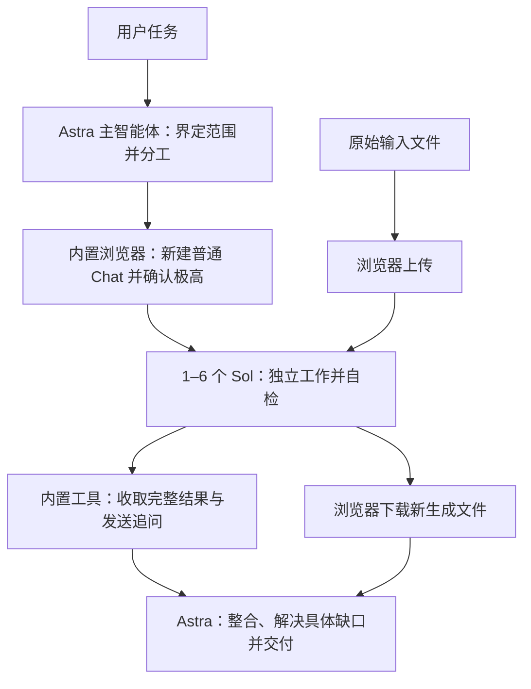

# ChatGPT Web Workers

**让 Astra 统筹，让 Sol 承担实质工作。**

[English](README.md) · [技能指令](skills/chatgpt-web-workers/SKILL.md) · [版本下载](https://github.com/YUTA-fywoo/chatgpt-web-workers/releases) · [MIT 许可证](LICENSE)

一个以**节约 Astra / Codex 主任务额度、减少重复开销**为目标的 Codex 桌面技能，采用 **Astra 主智能体 + 1–6 个 Sol 极高（Extra High / xhigh）普通 ChatGPT 对话**的分工。Sol 子智能体负责调研、分析、草稿、计算或代码方案，主智能体接收完整成果，完成跨部分判断、整合与最终交付。

**无需额外部署 MCP 服务器，无需配置 API Key。** 通过桌面应用已有的内置浏览器和对话读写工具，使用已登录的 ChatGPT 账号即可开展协作。

## 有什么好处？

| 特点 | 带来的实际价值 |
|---|---|
| 专为 Astra 主导设计 | 让主智能体处理任务框架、复杂判断、依赖关系与综合结论，把有边界、有分量的工作交给 Sol。 |
| 1–6 个网页子智能体 | 先派出所有已就绪且相互独立的任务，再等待结果；按需要增加数量，避免为并行而拆分。 |
| 文字通过内置工具收发 | 浏览器初始化后，直接按对话 ID 接收回复和发送追问，减少反复切页、读取页面的操作。 |
| 每块工作只有一个负责人 | 已交给 Sol 的搜索、计算与写作，主智能体不再同时重做；发现缺口优先让原负责人修正。 |
| 完整长稿只接收一次 | 保留 Astra 综合推理所需的细节和证据，后续过滤未变化的回复、重复预览和旧内容。 |
| 按实际问题追加检查 | Sol 先自检，主智能体验收整合；遇到矛盾、缺证据、文件异常或明确验证要求，再做针对性检查。 |
| 文件路线明确 | 上传原文件、接收 Sol 新生成文件，直接走浏览器，避免重复尝试不支持的附件参数。 |
| 同一任务继续用原对话 | 通过任务标记、版本和状态恢复进度，避免读到旧回复就重发，也避免不断创建新对话。 |

目标是节约 Astra / Codex 主任务额度：把实质工作交给普通 Chat，减少重复劳动、重复上下文和浏览器操作，让 Astra 把精力集中在最需要其能力的判断与整合上。

## 节约额度的原理

1. **把实质工作移出主任务。** 将一块完整调研、分析或长稿交给普通 Chat 中的 Sol。Astra 直接接收其成果，避免自己先完成一遍，再让子智能体重复一遍。
2. **减少浏览器操作和页面读取。** 浏览器创建对话、确认设置并发送首条任务后，日常文字通过内置对话工具读写，减少为收发消息反复切页、读取整页的开销。文件传输和有具体原因的恢复仍走浏览器。
3. **减少重复进入上下文的内容。** 完整长稿保留给 Astra，第一次完整接收后，后续只传状态或变化；不反复把旧提示、重复预览和未变化的报告塞回主任务。
4. **避免主智能体与子智能体做两遍。** 每块工作只有一个负责人，主智能体不重做已派出或已验收的搜索、计算和草稿。具体缺口优先交回原负责人；必要的执行和验证仍然保留。
5. **独立工作并行，连续工作复用对话。** 按任务规模选择数量，减少等待与反复铺垫，让可以同时推进的工作更早完成。

例如，一份报告可以把三块互不重叠的证据收集交给三个 Sol。Astra 保留问题、约束、报告结构与跨来源判断，完整接收三份成果后综合成文。可能节省的是主任务因此少做的工作和少读取的重复输入。

这套流程把合理分工与上下文管理结合起来：委派有用的工作，接收完整证据，后续只追问具体变化。[官方用量说明](https://learn.chatgpt.com/docs/pricing)也介绍了精简无关输入、聚焦上下文和合理组织输出对延长额度使用的帮助。

## 工作流程



浏览器创建和发送步骤依次进行，已发送任务的子智能体可以同时生成。存在依赖的任务仍按先后顺序执行。浏览器承担新建对话、设置、首条任务、文件上传下载以及需要时的恢复操作，日常文字交互交给内置工具。

文字通道使用内置 `read_thread` 和 `send_message_to_thread`。技能取得已持久化的对话 ID，用新回复中的任务标记和版本匹配请求，保持追问、修订和成果之间的对应关系。

## 使用条件

- 桌面应用中的 Codex，且主智能体可调用内置浏览器与对话读写工具。
- 已登录普通 ChatGPT **聊天 / Chat**；默认版本要求界面提供 **极高 / Extra High**。
- 在可用时选择 Astra 作为主智能体，发挥预设分工的优势。
- 在授权范围内，向各子对话提供它们需要的任务资料和文件。

本项目基于 Windows Codex 桌面版与中文普通 Chat 界面开发。

## 安装

### 让 Codex 安装独立 Skill

```text
$skill-installer 从 https://github.com/YUTA-fywoo/chatgpt-web-workers
安装 skills/chatgpt-web-workers 目录中的技能。
```

安装时选择仓库内的 **`skills/chatgpt-web-workers`** 技能目录。安装后如未显示，重启应用。安装方式依据[官方技能文档](https://learn.chatgpt.com/docs/build-skills)。

### 手动安装

从[版本发布页](https://github.com/YUTA-fywoo/chatgpt-web-workers/releases)下载 **Source code (zip)**，解压后取出里面的 `skills/chatgpt-web-workers` 文件夹，放进客户端识别的技能目录。当前官方文档列出的路径包括：

- 个人使用：`~/.agents/skills/chatgpt-web-workers/`
- 项目使用：`<项目>/.agents/skills/chatgpt-web-workers/`

本项目测试环境使用 `$CODEX_HOME/skills/chatgpt-web-workers`，通常为 `~/.codex/skills/chatgpt-web-workers`。以你的客户端实际发现技能的位置为准，不要在多个目录安装同名副本。最终文件夹应直接包含 `SKILL.md`、`agents/` 和 `references/`。

### 插件封装

仓库另提供 `.codex-plugin/plugin.json` 和 `skills/` 结构，便于作为插件分发；源码 ZIP 保留该结构。独立 Skill 适合快速安装，插件包提供相应的分发结构。

## 使用示例

```text
使用 $chatgpt-web-workers 调研【主题】。将互不依赖的工作分配给最多三个网页
子智能体，明确各自范围，最终给我一份包含来源、不确定性和建议的整合报告。
```

```text
使用 $chatgpt-web-workers 分析这两份文件。原文件只上传给确实需要它的子智能体。
汇总各自结论，并交付经过内容和格式检查的最终文件。
```

调用本技能后，每个任务使用 **至少 1 个、最多 6 个不同子对话**，替换对话也计入上限。简单任务从一个开始，较大的独立工作按需增加，同一子任务继续使用原对话。

## Plus 用户：改为 Sol High

如果你的 Plus 账号实际提供 **Sol High / 高**，但没有极高，可以让 Codex/GPT 明确改写本地版本：

```text
请把已安装的 chatgpt-web-workers 技能适配为我普通 ChatGPT 账号实际可用的
Sol High。统一修改默认强度以及依赖“极高”的浏览器检查和示例。保留 1–6 个
子对话上限、文字直连、文件走浏览器、单一负责人、完整结果接收和验收规则。
不要悄悄改用 Work 或 Pro 推理；设置不可用时说明情况，不要声称已经验证。
```

默认版使用极高；Plus 用户可按账号实际显示的选项，将本地技能适配为 Sol High。关于普通 Chat 的 Sol 思考滑块，可参见[官方更新](https://learn.chatgpt.com/docs/whats-new)。

## 为什么这样分配 Astra 与 Sol？

这是参考 [Astra 官方指南](https://developers.openai.com/api/docs/guides/latest-model)和 [Sol 官方指南](https://developers.openai.com/api/docs/guides/latest-model?model=gpt-5.6)作出的项目设计：Astra 保持整体目标和跨部分判断；Sol 接收清楚的目标、必要背景、约束和完成标准。提示避免重复要求和无用的中间叙述，完整成果仍保留给主智能体使用。目的就是把两种模型放在各自更能发挥价值的位置。

详细说明见[模型分工依据](skills/chatgpt-web-workers/references/model-guidance.md)、[通信机制](skills/chatgpt-web-workers/references/transport.md)和[文件处理](skills/chatgpt-web-workers/references/files.md)。

## 围绕完整交付设计

任务与版本匹配、已有附件复用、完整报告接收、Sol 自检和主智能体按需验收相互配合。遇到文件交付，流程要求实际取得下载文件，并检查所需内容和格式，让协作最终落到可用成果上。

本次发布保留六个技能文件，并增加双语说明与分发包。通信机制的实现依据记录在[技术说明](skills/chatgpt-web-workers/references/validation.md)中。

## 文件结构

```text
.codex-plugin/plugin.json         # 插件信息
skills/chatgpt-web-workers/
  SKILL.md                       # 智能体执行指令
  agents/openai.yaml             # 技能界面信息
  references/transport.md        # 创建、通信、并行与恢复
  references/files.md            # 上传和新生成文件下载
  references/model-guidance.md   # 模型分工与提示依据
  references/validation.md       # 已验证行为及限制
README.md                        # 英文说明
README.zh-CN.md                   # 中文说明
CHANGELOG.md
LICENSE
```

## 欢迎建议与反馈

对任务分工、通信方式或使用场景有更好的想法？欢迎通过 [GitHub Issues](https://github.com/YUTA-fywoo/chatgpt-web-workers/issues)提出建议。也欢迎分享实际使用体验、发现的问题和改进方案。反馈问题时，可以附上客户端/系统、界面模式与强度、预期行为和脱敏示例。

采用 [MIT 许可证](LICENSE)，保留许可声明即可使用、修改和分享。
